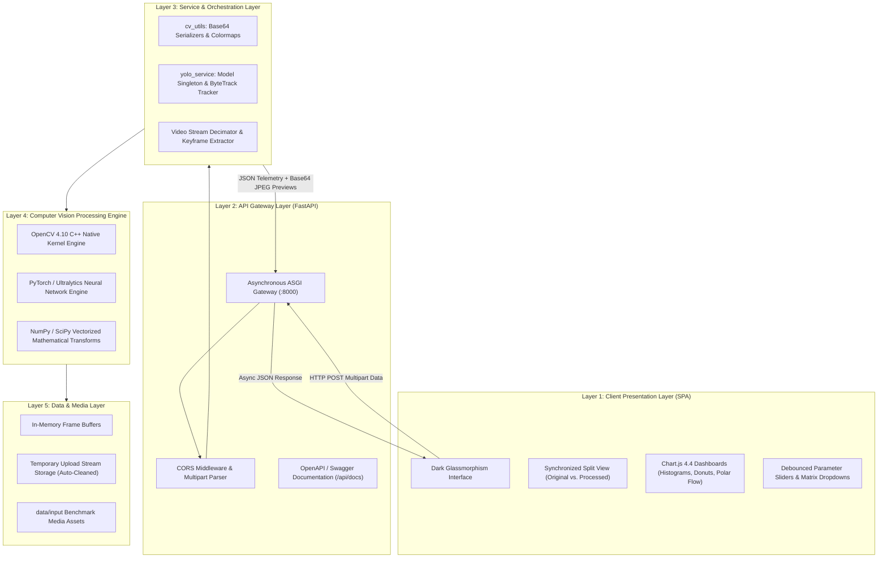
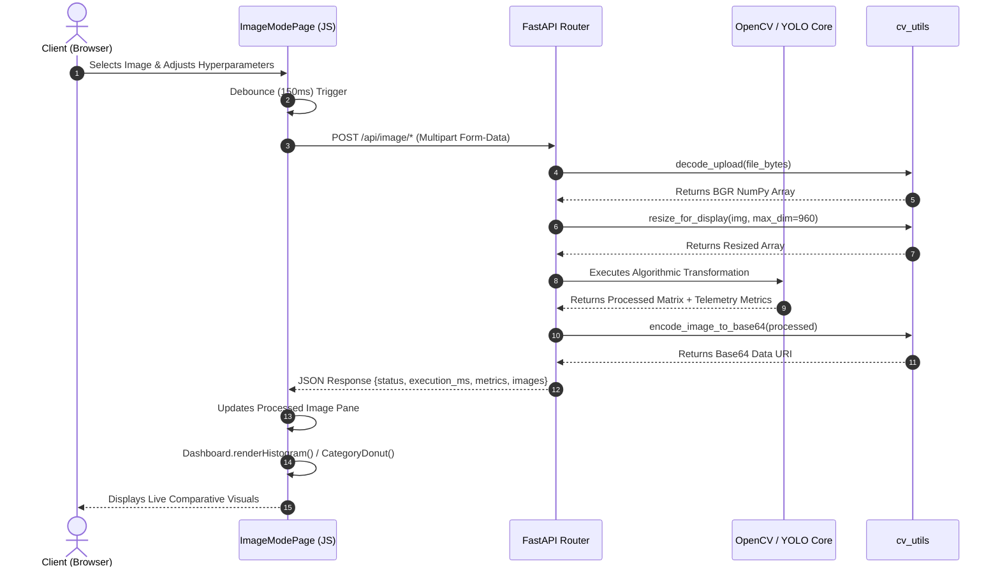
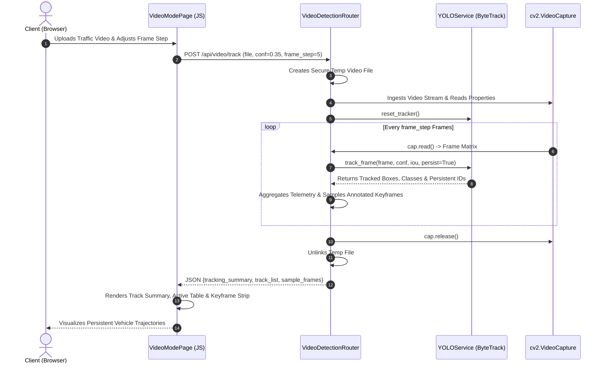

# VisionFlow-Traffic-Analytics — System Design & UML Diagrams

This document contains the complete set of architectural and UML design diagrams for **VisionFlow-Traffic-Analytics** as required by **Section 4 & Section 6 of the VITyarthi Project Evaluation Guidelines**.

---

## 1. System Architecture Diagram (5-Layer Decoupled Design)

---

## 2. Process Flow & System Workflow Diagram

```mermaid
flowchart LR
    Start([User Ingestion]) --> SelectMode{Select Modality}
    
    %% Mode A Flow
    SelectMode -->|Mode A: Image| UploadImg[Upload Static Image]
    UploadImg --> SelectImgModule[Select Module: 1..4]
    SelectImgModule --> TuneImgParams[Adjust Parameter Sliders]
    TuneImgParams --> RunImgEngine[Execute OpenCV / YOLO Pipeline]
    RunImgEngine --> SplitViewDisplay[Render Side-by-Side Split View]
    SplitViewDisplay --> ChartRender[Render Histograms & Donut Metrics]

    %% Mode B Flow
    SelectMode -->|Mode B: Video| UploadVid[Upload Video Stream]
    UploadVid --> SelectVidModule[Select Module: 5..7]
    SelectVidModule --> TuneVidParams[Adjust Decimation & Confidence]
    TuneVidParams --> DecodeStream[Decimate & Decode Video Frames]
    DecodeStream --> RunVidEngine[Execute ByteTrack / Optical Flow]
    RunVidEngine --> KeyframeRender[Render Keyframe Strip & Trajectories]
    KeyframeRender --> PolarRender[Render Polar Motion & Active Track Table]

    ChartRender --> Finish([Interactive Exploration])
    PolarRender --> Finish
```

---

## 3. UML Use Case Diagram

```mermaid
flowchart TD
    Student(("CV Student / Researcher"))
    Faculty(("Faculty / Evaluator"))

    subgraph ModeA_UseCases ["Mode A: Static Image Processing"]
        UC1["UC-1: Apply Spatial Filters (Gaussian, Median, Laplacian)"]
        UC2["UC-2: Perform Histogram Equalization & CLAHE"]
        UC3["UC-3: Execute Canny, LoG & Hough Edge Detection"]
        UC4["UC-4: Detect Harris Corners & Extract SIFT/HOG Features"]
        UC5["UC-5: Segment Image via K-Means, Mean Shift & Region Growing"]
        UC6["UC-6: Run YOLOv8 Object Detection with Confidence Sweeps"]
    end

    subgraph ModeB_UseCases ["Mode B: Video & Traffic Analytics"]
        UC7["UC-7: Ingest Video Stream & Extract Keyframe Strip"]
        UC8["UC-8: Track Multi-Objects with Persistent ByteTrack IDs"]
        UC9["UC-9: Compute Dense Farnebäck Flow & Polar Direction"]
        UC10["UC-10: Execute Lucas-Kanade Trajectory Tracking"]
        UC11["UC-11: Perform MOG2/KNN Dynamic Background Subtraction"]
    end

    subgraph Admin_UseCases ["Platform Management"]
        UC12["UC-12: Inspect OpenAPI Documentation (/api/docs)"]
        UC13["UC-13: Validate System Health (/api/health)"]
    end

    Student --> UC1
    Student --> UC2
    Student --> UC3
    Student --> UC4
    Student --> UC5
    Student --> UC6
    Student --> UC7
    Student --> UC8
    Student --> UC9
    Student --> UC10
    Student --> UC11

    Faculty --> UC6
    Faculty --> UC8
    Faculty --> UC12
    Faculty --> UC13
```

---

## 4. UML Component & Class Diagram

```mermaid
classDiagram
    class FastAPIApp {
        +app: FastAPI
        +health_check(): dict
    }

    class ImageProcessingRouter {
        +process_image(file, operation, kernel_size, sigma, alpha, beta, morph_op): dict
    }

    class FeatureAnalysisRouter {
        +analyze_features(file, method, canny_low, canny_high, harris_k, sift_max): dict
    }

    class SegmentationRouter {
        +segment_image(file, method, k_clusters, spatial_radius, region_tolerance): dict
    }

    class ObjectDetectionRouter {
        +detect_objects(file, conf_threshold, iou_threshold): dict
    }

    class VideoAnalysisRouter {
        +extract_video_info(file, num_keyframes): dict
    }

    class VideoDetectionRouter {
        +track_video_objects(file, conf, iou, frame_step): dict
    }

    class MotionAnalysisRouter {
        +analyze_video_motion(file, method, frame_step, history): dict
    }

    class CVUtils {
        +encode_image_to_base64(img, quality): str
        +decode_upload(file_bytes): ndarray
        +resize_for_display(img, max_dim): ndarray
        +to_grayscale(img): ndarray
        +ensure_bgr(img): ndarray
        +apply_colormap_jet(gray_img): ndarray
        +overlay_mask(img, mask, color, alpha): ndarray
        +draw_text_with_bg(img, text, pos): ndarray
    }

    class YOLOService {
        -_model: YOLO
        -_lock: Lock
        +get_model(): YOLO
        +detect_image(img, conf_threshold, iou_threshold): dict
        +track_frame(img, conf_threshold, iou_threshold, persist): dict
        +reset_tracker(): void
    }

    FastAPIApp --> ImageProcessingRouter
    FastAPIApp --> FeatureAnalysisRouter
    FastAPIApp --> SegmentationRouter
    FastAPIApp --> ObjectDetectionRouter
    FastAPIApp --> VideoAnalysisRouter
    FastAPIApp --> VideoDetectionRouter
    FastAPIApp --> MotionAnalysisRouter

    ImageProcessingRouter ..> CVUtils
    FeatureAnalysisRouter ..> CVUtils
    SegmentationRouter ..> CVUtils
    ObjectDetectionRouter ..> CVUtils
    ObjectDetectionRouter ..> YOLOService
    VideoAnalysisRouter ..> CVUtils
    VideoDetectionRouter ..> CVUtils
    VideoDetectionRouter ..> YOLOService
    MotionAnalysisRouter ..> CVUtils
```

---

## 5. UML Sequence Diagram (Mode A: Image Processing Pipeline)

---

## 6. UML Sequence Diagram (Mode B: Multi-Object Tracking Pipeline)

